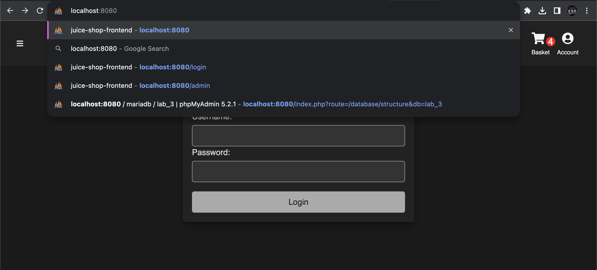
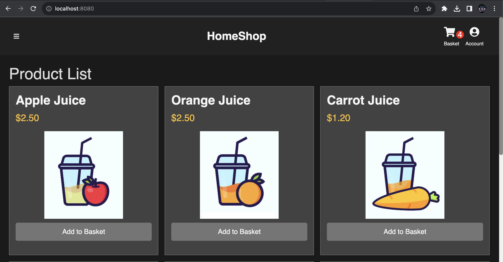
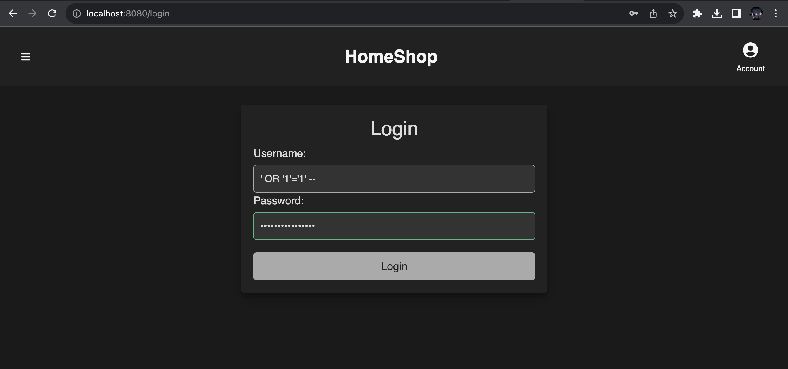
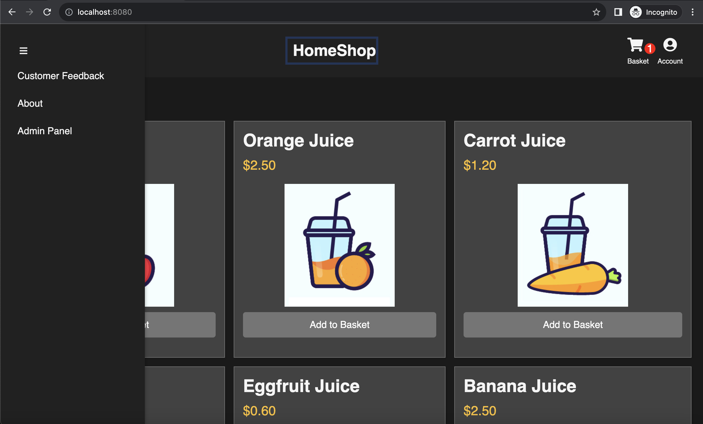
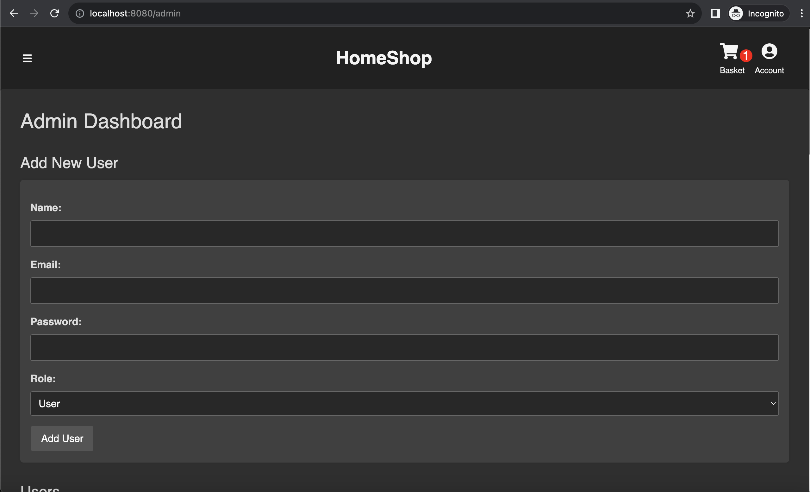
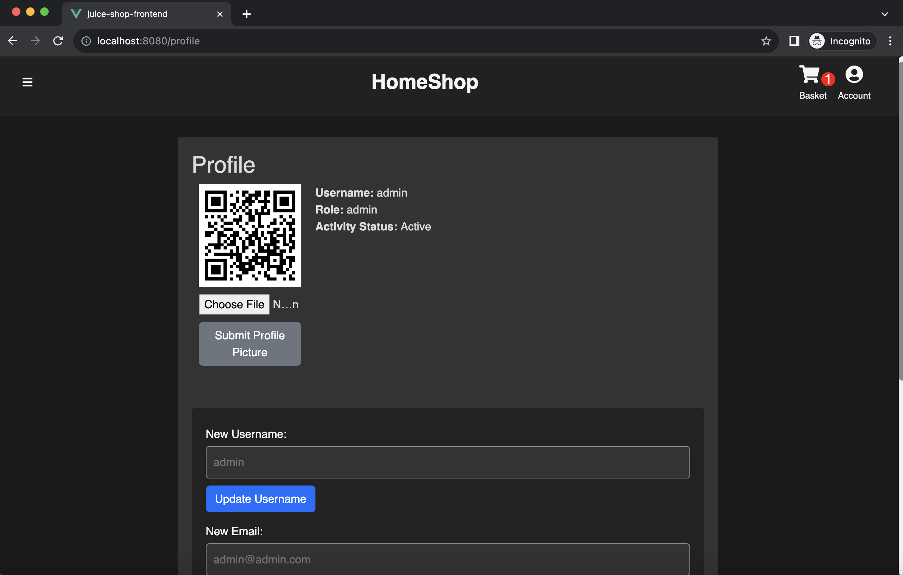
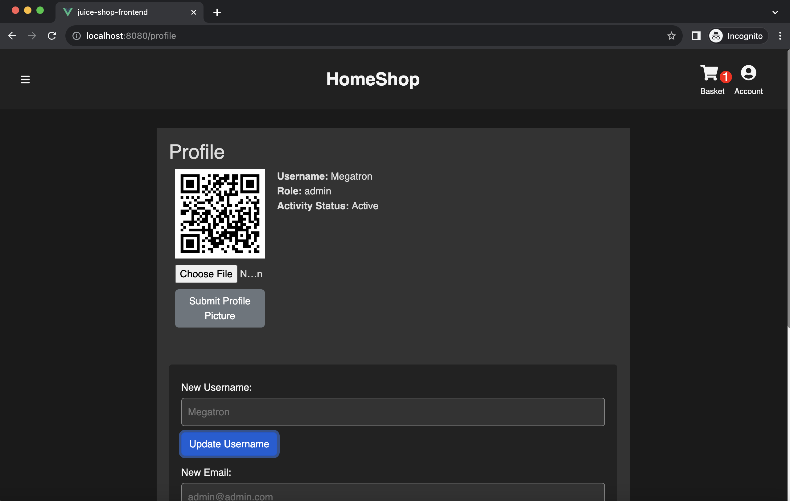

# Web Penetration Test Report:

#### Executive Summary:

This report highlights the most critical vulnerabilities of the HomeShop/ JuiceShop web application
as a result of my penetration testing efforts. In a controlled environment, I worked on exploiting common web vulnerabilities
 listed in the OWASP Top 10. From my efforts, I was able to discover several critical vulnerabilities including 
 directory traversal, unauthorized administrative access, and SQL injection. 

#### Test Details:

- **Author**: Jackson Stephens
- **Testing Platform**: HomeShop/ JuiceShop
- **Testing Tools Used**: Manual testing and vulnerability exploitation
- **Date of Test**: December 5th, 2023

#### Findings:

1. **Directory Traversal**  

   - **Description**: When initially accessing the site at "http://localhost:8080/login", I was able to adjust the url to "http://localhost:8080"
   which is the main page of the website, bypassing the user login and authentication (#1, 2).
   - **Exploitation**: An attacker could further exploit this vulnerability considering the website uses the same weak security practices for 
   the rest of the endpoints in their web application. 
   - **Impact**: Considering personally identifiable data were to be stolen, this could've seriously affected the users of the web application. This 
   Information could've been put up for ransom or further exploited by pivoting to other related applications. 
   - **Mitigation**: In order to solve this problem, validation and access controls need to be implemented into the web application.
   - **Images**: 
    
    

   #1: 
      - [Removing the "/login" path at the end of the URL.]
    

   #2: 
      - [Gaining user access to the web application through this directory traversal.]
     

2. **SQL Injection**  

   - **Description**: I was able to exploit the user login page with a common SQL injection script (#1). 
   - **Exploitation**: An attacker could further exploit this vulnerability by running direct SQL commands to access, modify, or delete data in the 
   web application's database.
   - **Impact**: This could result in data loss, corruption, or the breach of confidential information regarding clients and users. 
   - **Mitigation**: In order to solve this problem, prepared statements and the sanitization of user input is necessary. 
   - **Images**:
    
    

   #1: 
      - [Using my SQL injection administrative bypass script as user credentials.]
    

   #2: 
      - [Gaining administrator privileges in the website.]
     

   #3: 
      - [By clicking on the "Admin Panel" button, being redirected to the "Admin Dashboard".]
     
   
     
3. **Unauthorized Administrative Access**  

   - **Description**: Piggy backing off the SQL injection attack, I was able to use my administrative permissions to get to the "/profile" endpoint and change the web application's admin credentials (#1, 2).
   - **Exploitation**: An attacker could further exploit this vulnerability by using these same credentials to log into the database hosting the web application, or  pivot into the "Admin Dashboard"
   and remove users, customer reviews, adjust permissions, and so forth. 
   - **Impact**: If an attacker were to exploit this vulnerability, HomeShop/ JuiceShop could potentially lose access to their web application in its entirety. 
   - **Mitigation**: In order to solve this problem, authentication procedures and measures must be improved when initially logging into the web application. 
   - **Images**: 
    
    

   #1: 
      - [From my previous SQL injection gaining administrative access, I was able to access the "/admin" endpoint.]
    

   #2: 
      - [From the "/admin" endpoint, I was able to change the admin username to "Megatron"!]
     
     
#### Recommendations:

   This website is incredibly vulnerable. In order to mitigate the risk of the vulnerabilities outlined above, strict access control procedures, prepared statements, and the sanitization
    of user input should be implemented immediately. Furthermore, regular penetration tests and security audits should also be put in place to prevent future problems and vulnerabilities. 

#### Conclusion:

   Overall, this penetration test revealed the critical vulnerabilities in the HomeShop/ JuiceShop website. Patches for the outlined vulnerabilities should be implemented immediately! 
   If you have any further questions, feel free to contact me @jack456@byu.edu. 

---

